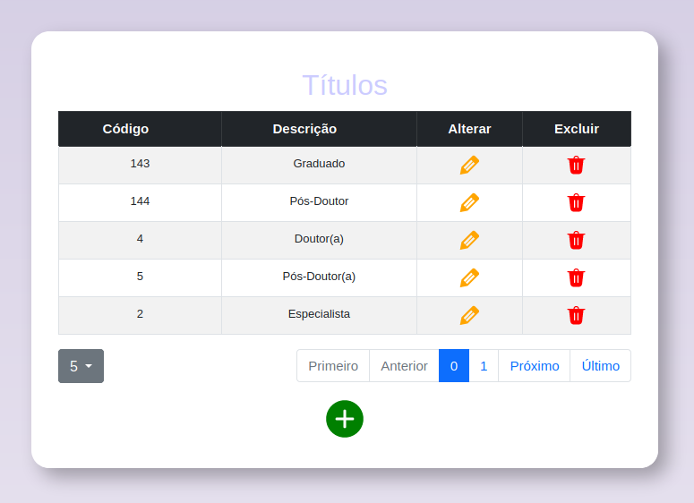

# EXERCÍCIO

### Questão 1) Organize a API axios para executar ações de CRUD na API REST desenvolvida por vocês em sala de aula (VALOR = 5,0)

### Questão 2) Crie um CRUD à semelhança da imagem vista abaixo (que trata do CRUD da tabela título), entretanto, neste exercício, o CRUD a ser desenvolvido é o da tabela professor (VALOR = 5,0)

